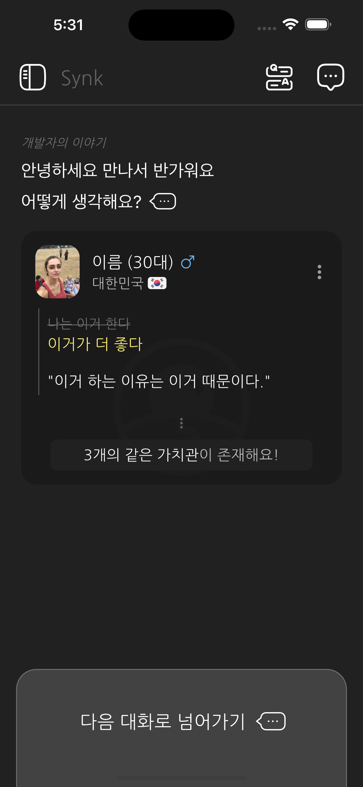

# D-62
## 오늘 한 일

1. _프로필 템플릿을 만듬_

이것을 재활용을 많이 할 것 같아서 만들었다. 이걸로 소개, 채팅 등등 광범위하게 쓰일듯.  
의외로 내가 생각한 것은, __UI__ 때문에 시간이 꽤 많이 잡아먹힌다는것이다. 이거 하나 만드는데 거의 3시간이 넘어갔던 것 같다.  
[ _개발을 끝내는 데 2달_ ] 이라는 목표를 달성하기 위해서는 UI에 시간을 좀 덜 써야하는 걸까? 이 부분을 좀 고민을 해봐야 할 듯 하다.

후에 이 위젯이 이쁘게 애니메이션 되서 나오게 하게 잘 설정해야 한다.
- [ ] 위젯 애니메이션 적용시키기
  

  

2. _채팅이 자동으로 아래로 내려가는 기능_

사실 뭐 별거 없는 기능이지만, 텍스트가 써질 때 아래로 자동으로 내려가게 설정하였다.
만약 위로 많이 올라와 있는 상태에서는 그냥 무시되게 했다. 위에꺼 보고있을수도 있으므로

  
___

### 결론
속도를 더 빨리 내야할 것 같다. 개발 완료까지 60일이라고 쳐도, 서버와 모든걸 연동하고, 설정하고 하다보면 시간이 빠듯할듯. 화이팅하자